# 🚗 차량용 이더넷 TSN Credit-Based Shaper 구현 및 성능 검증

[](https://standards.ieee.org/standard/802_1Qav-2009.html)
[](https://www.microchip.com)
[](https://1.ieee802.org/tsn/)
[](paper_complete.tex)

## 📋 Executive Summary

본 연구는 차세대 자동차 네트워크 아키텍처에서 핵심 기술로 부상한 **IEEE 802.1Qav Credit-Based Shaper (CBS)** 메커니즘을 실제 하드웨어 환경에서 구현하고 검증한 실증적 연구입니다.

### 🎯 핵심 성과

<table>
<tr>
<td width="50%">

#### 📊 성능 개선 지표
- **프레임 손실률**: 21.5% → 0.67% **(96.9% ⬇️)**
- **평균 지터**: 42.3ms → 3.1ms **(92.7% ⬇️)**
- **평균 지연**: 68.4ms → 8.3ms **(87.9% ⬇️)**
- **대역폭 보장**: 55% → 98% **(78% ⬆️)**

</td>
<td width="50%">

#### 🏆 주요 기여
- ✅ Microchip LAN9692 기반 CBS 구현
- ✅ 실제 영상 스트림 기반 검증
- ✅ 파라미터 최적화 가이드라인
- ✅ 존 아키텍처 적용 방법론

</td>
</tr>
</table>

---

## 📖 Table of Contents

1. [연구 배경](#-연구-배경)
2. [시스템 아키텍처](#-시스템-아키텍처)
3. [CBS 이론 및 구현](#-cbs-이론-및-구현)
4. [실험 환경](#-실험-환경)
5. [실험 결과](#-실험-결과)
6. [성능 분석](#-성능-분석)
7. [구현 가이드](#-구현-가이드)
8. [프로젝트 구조](#-프로젝트-구조)
9. [향후 연구](#-향후-연구)

---

## 🌟 연구 배경

### 차량 E/E 아키텍처의 진화

```mermaid
graph LR
    A[1세대<br/>분산형] --> B[2세대<br/>도메인 기반]
    B --> C[3세대<br/>존 기반]
    C --> D[4세대<br/>중앙집중형]
    
    style A fill:#f9f,stroke:#333,stroke-width:2px
    style B fill:#bbf,stroke:#333,stroke-width:2px
    style C fill:#bfb,stroke:#333,stroke-width:4px
    style D fill:#fbb,stroke:#333,stroke-width:2px
```



### 네트워크 요구사항 증가

| 기술 | 데이터 생성량 | 지연 요구사항 | 신뢰성 |
|------|--------------|--------------|--------|
| **자율주행 센서** | ~4 GB/s | < 10ms | 99.999% |
| **인포테인먼트** | ~100 MB/s | < 100ms | 99.9% |
| **제어 신호** | ~1 MB/s | < 1ms | 99.9999% |
| **진단/OTA** | ~10 MB/s | Best Effort | 99% |

### TSN의 필요성

기존 CAN/FlexRay의 한계:
- ❌ **대역폭 부족**: CAN 1Mbps, FlexRay 10Mbps
- ❌ **확장성 제한**: 고정된 타임슬롯
- ❌ **높은 비용**: 전용 하드웨어 필요

TSN 이더넷의 장점:
- ✅ **고대역폭**: 1Gbps ~ 10Gbps
- ✅ **유연성**: 동적 대역폭 할당
- ✅ **표준화**: IEEE 802.1 표준
- ✅ **비용 효율**: 범용 이더넷 기술

---

## 🏗️ 시스템 아키텍처

### 하드웨어 플랫폼

<table>
<tr>
<td width="60%">

#### Microchip LAN9692 TSN Switch SoC

```
┌─────────────────────────────────────┐
│          LAN9692 Architecture        │
├─────────────────────────────────────┤
│  ┌─────────────────────────────┐    │
│  │   ARM Cortex-A53 @ 1GHz     │    │
│  └─────────────────────────────┘    │
│  ┌─────────────────────────────┐    │
│  │   TSN Hardware Accelerator   │    │
│  │   - CBS Engine              │    │
│  │   - TAS Scheduler            │    │
│  │   - IEEE 1588 Timestamping  │    │
│  └─────────────────────────────┘    │
│  ┌─────────────────────────────┐    │
│  │   4-Port Gigabit Switch     │    │
│  │   8 Queues per Port         │    │
│  └─────────────────────────────┘    │
└─────────────────────────────────────┘
```

</td>
<td width="40%">

#### 주요 사양

| 항목 | 사양 |
|------|------|
| **CPU** | ARM Cortex-A53 64-bit |
| **Clock** | 1 GHz |
| **Memory** | 2MiB ECC SRAM |
| **Ports** | 4× GbE (SFP+) |
| **Queues** | 8 per port |
| **TSN** | CBS, TAS, PSFP |
| **PTP** | HW Timestamping |
| **Cert** | AEC-Q100 Grade 2 |

</td>
</tr>
</table>

### 소프트웨어 스택

```
┌──────────────────────────────────────┐
│         Application Layer             │
│    (Test Scripts, Monitoring)         │
├──────────────────────────────────────┤
│         YANG Data Models              │
│  • ieee802-dot1q-bridge              │
│  • ieee802-dot1q-sched               │
│  • ieee802-dot1q-cbs                 │
├──────────────────────────────────────┤
│      VelocityDRIVE-SP RTOS           │
│    (TSN Protocol Stack)               │
├──────────────────────────────────────┤
│    Hardware Abstraction Layer         │
└──────────────────────────────────────┘
         ↕ UART/CoAP Interface
```

### 네트워크 토폴로지

```
    [Video Source PC1]              [Receiver PC2]
           │                              │
      Port 8 ↓                       Port 10 ↑
    ┌──────────────────────────────────────────┐
    │                                          │
    │          LAN9692 TSN Switch              │
    │                                          │
    └──────────────────────────────────────────┘
      Port 9 ↓                       Port 11 ↑
           │                              │
    [BE Traffic PC4]               [Receiver PC3]
    
    ━━━ Video Stream (Priority 6-7)
    ┅┅┅ BE Traffic (Priority 0)
```

---

## 📐 CBS 이론 및 구현

### Credit-Based Shaper 동작 원리

CBS는 각 트래픽 클래스에 대해 '크레딧(credit)' 토큰을 관리하여 전송을 제어합니다.

#### 핵심 파라미터

| 파라미터 | 설명 | 계산식 |
|---------|------|--------|
| **idleSlope** | 크레딧 증가율 | `StreamRate × (1 + Margin)` |
| **sendSlope** | 크레딧 감소율 | `idleSlope - PortRate` |
| **hiCredit** | 크레딧 상한 | `(idleSlope × MaxFrameSize) / PortRate` |
| **loCredit** | 크레딧 하한 | `-hiCredit` |

#### 크레딧 동역학

```python
def credit_dynamics(t, queue_state):
    if queue_state == "IDLE" and credit < hiCredit:
        credit += idleSlope * dt  # 크레딧 증가
    elif queue_state == "TRANSMITTING":
        credit += sendSlope * dt  # 크레딧 감소 (sendSlope < 0)
    
    can_transmit = (credit >= 0) and frame_ready
```

### 대역폭 보장 메커니즘

```
시간 →
Credit ↑
        │     ╱╲      ╱╲      ╱╲
hiCredit├────╱──╲────╱──╲────╱──╲────
        │   ╱    ╲  ╱    ╲  ╱    ╲
        │  ╱      ╲╱      ╲╱      ╲
       0├─────────────────────────────
        │         Transmit Enable
loCredit├─────────────────────────────
        │
        └─────────────────────────────
          IDLE  TX  IDLE  TX  IDLE  TX
```

### 구현 설정 (YAML)

```yaml
# CBS Configuration for Video Stream
- ? "/ietf-interfaces:interfaces/interface[name='11']/
     ieee802-dot1q-bridge:bridge-port/
     ieee802-dot1q-sched:traffic-class-table[traffic-class='7']"
  : 
    transmission-selection-algorithm:
      credit-based-shaper:
        idle-slope: 20000000    # 20 Mbps
        send-slope: -980000000  # -980 Mbps  
        hi-credit: 243
        lo-credit: -243
```

---

## 🧪 실험 환경

### 실험 시나리오

<table>
<tr>
<th width="50%">시나리오 1: CBS 비활성화 (Baseline)</th>
<th width="50%">시나리오 2: CBS 활성화</th>
</tr>
<tr>
<td>

```
모든 트래픽 FIFO 처리
├── Video Stream 1 (15 Mbps)
├── Video Stream 2 (15 Mbps)
└── BE Traffic (0-800 Mbps)
    
결과 예상:
• 높은 프레임 손실
• 불규칙한 지터
• 영상 품질 저하
```

</td>
<td>

```
우선순위 기반 처리
├── TC7: Video 1 (idleSlope=20M)
├── TC6: Video 2 (idleSlope=20M)
└── TC0: BE Traffic (나머지)
    
결과 예상:
• 낮은 프레임 손실
• 일정한 지터
• 안정적 영상 재생
```

</td>
</tr>
</table>

### 트래픽 생성

#### 영상 스트림 (H.264/MPEG-TS)
```bash
cvlc --loop video.mp4 \
  --sout "#transcode{vcodec=h264,vb=15000}:duplicate{
    dst=std{access=udp{ttl=16,mtu=1400},mux=ts,dst=10.0.100.2:5005},
    dst=std{access=udp{ttl=16,mtu=1400},mux=ts,dst=10.0.100.3:5005}
  }"
```

#### BE 트래픽 (iperf3)
```bash
iperf3 -c 10.0.100.2 -u -b 800M -t 60 -i 1
```

### 측정 도구

| 계층 | 측정 항목 | 도구 |
|------|----------|------|
| **네트워크** | 처리량, 패킷 손실 | tcpdump, Wireshark |
| **전송** | 지터, 지연 | RTP 분석, PTP |
| **애플리케이션** | 프레임 손실, 버퍼링 | VLC 통계 |
| **품질** | PSNR, SSIM, MOS | FFmpeg, 주관평가 |

---

## 📊 실험 결과

### 1. 처리량 비교

#### BE 트래픽 부하에 따른 영상 스트림 처리량

```
Throughput (Mbps)
16 ┤                                 CBS ON
15 ┤━━━━━━━━━━━━━━━━━━━━━━━━━━━━━━━━━━━━━━
14 ┤                                      
12 ┤           CBS OFF                    
10 ┤       ╱╲                             
 8 ┤     ╱    ╲___________                
 6 ┤   ╱                                  
 4 ┤ ╱                                    
 2 ┤                                      
 0 └────┬────┬────┬────┬────┬────┬────
     0   100  200  400  600  800 (BE Load Mbps)
```

| BE Load | CBS OFF |  | CBS ON |  |
|---------|---------|--|--------|--|
| (Mbps) | Stream1 | Stream2 | Stream1 | Stream2 |
| 0 | 15.0 | 15.0 | 15.0 | 15.0 |
| 100 | 14.8 | 14.9 | 15.0 | 15.0 |
| 200 | 14.2 | 14.3 | 14.9 | 15.0 |
| 400 | 12.1 | 11.8 | 14.9 | 14.9 |
| 600 | 9.3 | 8.9 | 14.8 | 14.9 |
| **800** | **8.3** | **7.9** | **14.8** | **14.7** |

### 2. 프레임 손실률

#### 시간에 따른 프레임 손실 패턴

```
Frame Loss (%)
25 ┤     CBS OFF
20 ┤   ╱─────────────────
15 ┤ ╱╱                  
10 ┤╱                    
 5 ┤                     
 0 ┤━━━━━━━━━━━━━━━━━━━━ CBS ON
   └────┬────┬────┬────┬────
        15   30   45   60 (seconds)
```

| 측정 항목 | CBS OFF | CBS ON | 개선율 |
|----------|---------|--------|--------|
| **총 프레임** | 1,800 | 1,800 | - |
| **손실 프레임** | 387 | 12 | 96.9% ⬇️ |
| **손실률** | 21.5% | 0.67% | 96.9% ⬇️ |
| **최대 연속 손실** | 23 | 2 | 91.3% ⬇️ |

### 3. 지터 분석

#### 지터 분포 히스토그램

```
Probability
0.4 ┤    CBS ON
0.3 ┤     │
0.2 ┤     │
0.1 ┤  ╱──┴──╲      CBS OFF
0.0 └──────────╱────────╲──────
    0    10    20    40    60  (Jitter ms)
         μ=3.1ms    μ=42.3ms
```

| 지터 메트릭 | CBS OFF | CBS ON | 개선율 |
|------------|---------|--------|--------|
| **평균 (ms)** | 42.3 | 3.1 | 92.7% ⬇️ |
| **표준편차 (ms)** | 15.2 | 1.2 | 92.1% ⬇️ |
| **최대 (ms)** | 143.5 | 8.5 | 94.1% ⬇️ |
| **99-percentile** | 98.7 | 6.3 | 93.6% ⬇️ |

### 4. 지연 특성

```
Latency (ms)
200 ┤     CBS OFF
150 ┤   ╱╲    ╱╲
100 ┤ ╱    ╲╱    ╲
 50 ┤              ╲___
  0 ┤━━━━━━━━━━━━━━━━━━ CBS ON (8.3ms avg)
    └──────────────────────
```

| 지연 메트릭 | CBS OFF | CBS ON | 개선율 |
|------------|---------|--------|--------|
| **평균 (ms)** | 68.4 | 8.3 | 87.9% ⬇️ |
| **최대 (ms)** | 185.2 | 12.5 | 93.2% ⬇️ |
| **최소 (ms)** | 23.1 | 5.2 | 77.5% ⬇️ |

### 5. 영상 품질 평가

#### 객관적 품질 지표

| 품질 지표 | CBS OFF | CBS ON | 개선 |
|----------|---------|--------|------|
| **PSNR (dB)** | 28.3 | 42.1 | +13.8 dB |
| **SSIM** | 0.72 | 0.96 | +33.3% |
| **VQM** | 4.2 | 1.3 | -69.0% |
| **버퍼링 이벤트** | 23 | 0 | -100% |

#### 주관적 품질 평가 (MOS, 1-5 척도)

```
       CBS OFF  CBS ON
       ┌─────┐  ┌─────┐
   5.0 │     │  │ ███ │ 4.8
   4.0 │     │  │ ███ │
   3.0 │     │  │ ███ │
   2.0 │ ███ │  │ ███ │
   1.0 │ ███ │  │     │
   0.0 └─────┘  └─────┘
       MOS=2.0  MOS=4.8
```

---

## 📈 성능 분석

### 대역폭 활용 패턴

#### CBS 활성화 시 시간별 대역폭 활용

```
Bandwidth (Mbps)
1000 ┤ ┌─────────────────────────┐
 800 ┤ │░░░░░░░ BE Traffic ░░░░░░│
 600 ┤ │░░░░░░░░░░░░░░░░░░░░░░░░░│
 400 ┤ │░░░░░░░░░░░░░░░░░░░░░░░░░│
 200 ┤ │░░░░░░░░░░░░░░░░░░░░░░░░░│
  30 ┤ │▓▓▓▓ Video Stream 2 ▓▓▓▓▓│
  15 ┤ │████ Video Stream 1 ██████│
   0 └─┴─────────────────────────┴─
     0                          60 (seconds)
```

### 효율성 분석

| 트래픽 클래스 | 할당 대역폭 | 실제 사용 | 효율 |
|--------------|------------|----------|------|
| **Video TC7** | 20 Mbps | 14.8 Mbps | 74.0% |
| **Video TC6** | 20 Mbps | 14.7 Mbps | 73.5% |
| **BE TC0** | 960 Mbps | 750.5 Mbps | 78.2% |
| **Total** | 1000 Mbps | 780.0 Mbps | 78.0% |

### 핵심 성과 요약

<table>
<tr>
<td width="33%">

#### 🎯 대역폭 보장
```
   CBS OFF    CBS ON
   ┌─────┐   ┌─────┐
   │ 55% │   │ 98% │
   └─────┘   └─────┘
    ↑ 78% 개선
```

</td>
<td width="33%">

#### 📉 손실률 감소
```
   CBS OFF    CBS ON
   ┌─────┐   ┌─────┐
   │21.5%│   │0.67%│
   └─────┘   └─────┘
    ↑ 96.9% 개선
```

</td>
<td width="33%">

#### ⏱️ 지터 개선
```
   CBS OFF    CBS ON  
   ┌─────┐   ┌─────┐
   │42.3 │   │ 3.1 │
   │ ms  │   │ ms  │
   └─────┘   └─────┘
    ↑ 92.7% 개선
```

</td>
</tr>
</table>

---

## 🛠️ 구현 가이드

### 1. 환경 설정

#### 필요 하드웨어
- Microchip EVB-LAN9692-LM 평가 보드
- 4개의 Linux PC (Ubuntu 20.04+)
- Gigabit Ethernet 케이블

#### 필요 소프트웨어
```bash
# 송신/수신 PC
sudo apt-get update
sudo apt-get install -y \
  vlc \
  iperf3 \
  tcpdump \
  wireshark \
  ethtool \
  iproute2
```

### 2. VLAN 및 우선순위 설정

#### 송신 측 설정
```bash
#!/bin/bash
# VLAN 인터페이스 생성
sudo ip link add link eth0 name eth0.100 type vlan id 100
sudo ip addr add 10.0.100.1/24 dev eth0.100
sudo ip link set eth0.100 up

# PCP 매핑 설정 (skb priority → VLAN PCP)
sudo ip link set dev eth0.100 type vlan \
  egress-qos-map 0:0 1:1 2:2 3:3 4:4 5:5 6:6 7:7

# 트래픽 클래스 필터 설정
sudo tc qdisc add dev eth0.100 clsact
sudo tc filter add dev eth0.100 egress protocol ip u32 \
  match ip dport 5005 0xffff action skbedit priority 7
```

### 3. TSN 스위치 CBS 설정

#### YAML 설정 파일 작성
```yaml
# cbs-config.yaml
- ? "/ietf-interfaces:interfaces/interface[name='11']/
     ieee802-dot1q-bridge:bridge-port/
     ieee802-dot1q-sched:traffic-class-table"
  :
    - traffic-class: 7
      transmission-selection-algorithm:
        credit-based-shaper:
          idle-slope: 20000000
          send-slope: -980000000
          hi-credit: 243
          lo-credit: -243
    - traffic-class: 6
      transmission-selection-algorithm:
        credit-based-shaper:
          idle-slope: 20000000
          send-slope: -980000000
          hi-credit: 243
          lo-credit: -243
```

#### 설정 적용
```bash
# MUP1 채널을 통한 설정 전송
sudo dr mup1cc -d /dev/ttyACM0 -m ipatch -i cbs-config.yaml

# 설정 확인
sudo dr mup1cc -d /dev/ttyACM0 -m fetch \
  -p "/ieee802-dot1q-bridge:bridges"
```

### 4. 트래픽 생성 및 측정

#### 영상 스트림 전송
```bash
# sender.sh
#!/bin/bash
cvlc --loop /path/to/video.mp4 \
  --sout "#transcode{vcodec=h264,vb=15000,acodec=mp4a,ab=128}:\
  duplicate{
    dst=std{access=udp{ttl=16,mtu=1400},mux=ts,dst=10.0.100.2:5005},
    dst=std{access=udp{ttl=16,mtu=1400},mux=ts,dst=10.0.100.3:5005}
  }" \
  --network-caching=100
```

#### 자동화된 측정 스크립트
```bash
# measure.sh
#!/bin/bash
for load in 0 100 200 400 600 800; do
  echo "Testing BE load: ${load}Mbps"
  
  # BE 트래픽 생성
  iperf3 -c 10.0.100.2 -u -b ${load}M -t 60 &
  PID_IPERF=$!
  
  # 패킷 캡처
  sudo tcpdump -i eth0.100 -w capture_${load}.pcap &
  PID_TCPDUMP=$!
  
  # VLC 통계 수집
  cvlc udp://@:5005 --intf dummy --sout "#stat" \
    > stats_${load}.log 2>&1 &
  PID_VLC=$!
  
  sleep 65
  
  # 프로세스 종료
  kill $PID_IPERF $PID_TCPDUMP $PID_VLC
  wait
done
```

### 5. 파라미터 튜닝 가이드

#### idleSlope 설정 권장사항

| 트래픽 유형 | 실제 비트레이트 | 권장 idleSlope | 여유율 |
|------------|---------------|----------------|--------|
| HD Video | 15 Mbps | 20 Mbps | 33% |
| 4K Video | 25 Mbps | 35 Mbps | 40% |
| Audio | 256 kbps | 512 kbps | 100% |
| Control | 1 Mbps | 2 Mbps | 100% |

#### 크레딧 한계 계산
```python
def calculate_credit_limits(idle_slope, port_rate, max_frame_size=1518):
    """
    CBS 크레딧 한계 계산
    
    Args:
        idle_slope: bps 단위 idleSlope
        port_rate: bps 단위 포트 속도
        max_frame_size: 바이트 단위 최대 프레임 크기
    
    Returns:
        (hi_credit, lo_credit) 튜플
    """
    hi_credit = (idle_slope * max_frame_size * 8) / port_rate
    lo_credit = -hi_credit
    return (hi_credit, lo_credit)

# 예시: 20Mbps idleSlope, 1Gbps 포트
hi, lo = calculate_credit_limits(20e6, 1e9)
print(f"hiCredit: {hi:.0f}, loCredit: {lo:.0f}")
# 출력: hiCredit: 243, loCredit: -243
```

---

## 📁 프로젝트 구조

```
research_paper/
│
├── 📄 논문 및 문서
│   ├── paper_complete.tex      # 완전한 LaTeX 논문
│   ├── README.md               # 프로젝트 개요 (이 파일)
│   └── 통신학회_CBS구현.hwp    # 원본 한글 논문
│
├── 🔧 설정 파일
│   ├── ipatch-cbs-idle-slope.yaml    # CBS 파라미터 설정
│   ├── ipatch-vlan-set.yaml          # VLAN 설정
│   ├── ipatch-p8-deco-p10-enco.yaml  # 포트 8→10 스트림
│   ├── ipatch-p8-deco-p11-enco.yaml  # 포트 8→11 스트림
│   └── ipatch-p9-deco-p11-enco.yaml  # 포트 9→11 스트림
│
├── 📜 스크립트
│   ├── receiver_pc1_test.sh    # 수신 PC 설정 스크립트
│   ├── sender_video.sh         # 영상 전송 스크립트
│   └── measure_performance.sh  # 성능 측정 자동화
│
├── 📊 실험 데이터
│   ├── results/
│   │   ├── throughput.csv
│   │   ├── latency.csv
│   │   └── frame_loss.csv
│   └── captures/
│       └── *.pcap files
│
└── 📚 참고 자료
    └── EVB-LAN9692-LM-User-Guide.pdf
```

---

## 🔬 향후 연구

### 단기 계획 (3-6개월)

1. **다중 스위치 환경**
   - Daisy-chain 및 Ring 토폴로지
   - 누적 지연 분석
   - 경로 다중화 (IEEE 802.1CB FRER)

2. **동적 트래픽 패턴**
   - 실제 차량 주행 데이터 기반 시뮬레이션
   - 버스트 트래픽 처리
   - 적응형 파라미터 조정

3. **TAS와 CBS 조합**
   - Gate Control List 최적화
   - 하이브리드 스케줄링
   - 지연 경계 분석

### 중장기 계획 (6-12개월)

1. **AI 기반 최적화**
   - 강화학습 기반 파라미터 자동 튜닝
   - 트래픽 예측 모델
   - 이상 탐지 시스템

2. **보안 강화**
   - MACsec 통합
   - 침입 탐지 시스템
   - 안전 인증 획득

3. **표준화 기여**
   - IEEE 802.1 작업 그룹 참여
   - 차량용 TSN 프로파일 정의
   - 테스트 벤치마크 개발

---

## 👥 연구팀

**TSN팀, 차량전자연구부**

- Research Team A - CBS 구현 및 실험
- Research Team B - 네트워크 설정 및 분석  
- Research Team C - 영상 스트림 처리
- Research Team D - 프로젝트 총괄

---

## 📚 참고문헌

### 핵심 표준
1. IEEE 802.1Qav - Credit-Based Shaper
2. IEEE 802.1Qbv - Time-Aware Shaper
3. IEEE 802.1AS - Timing and Synchronization

### 주요 논문
1. Kehrer et al., "Fault-tolerance concepts for IEEE 802.1 TSN" (2014)
2. Imtiaz et al., "Performance study of Ethernet AVB" (2009)
3. Park et al., "FPGA-based TSN Switch Implementation" (2022)

### 기술 문서
1. Microchip LAN9692 Datasheet
2. VelocityDRIVE-SP User Guide
3. YANG RFC 7950

---

## 📝 라이선스

이 프로젝트는 연구 목적으로 공개되었습니다.
상업적 사용 시 연구팀에 문의 바랍니다.

---

## 🤝 기여 방법

1. Fork the repository
2. Create your feature branch (`git checkout -b feature/AmazingFeature`)
3. Commit your changes (`git commit -m 'Add some AmazingFeature'`)
4. Push to the branch (`git push origin feature/AmazingFeature`)
5. Open a Pull Request

---

## 📧 연락처

- Email: tsn-team@keti.re.kr
- GitHub: https://github.com/hwkim3330/research_paper
- Issues: https://github.com/hwkim3330/research_paper/issues

---

<div align="center">

**🏆 성과 요약 🏆**

| 지표 | 개선율 | 의미 |
|------|--------|------|
| **프레임 손실** | 96.9% ⬇️ | 끊김 없는 영상 |
| **지터** | 92.7% ⬇️ | 안정적 재생 |
| **지연** | 87.9% ⬇️ | 실시간 반응 |
| **대역폭 보장** | 78% ⬆️ | QoS 확보 |

*"CBS는 차세대 자동차 네트워크의 핵심 기술입니다"*

</div>